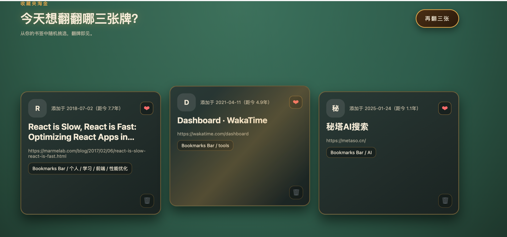

# Collection Miner / 收藏夹淘金

## 中文说明

这是一个多维度、高颜值的 Chrome 插件，旨在让你在打开新标签页时，“淘”到你曾经收藏过但可能遗忘的珍宝。

### 核心功能

1.  **多来源支持 (Tabs)**：
    -   **浏览器收藏夹**：随机展示 3 条书签。
    -   **豆瓣书影音**：支持导入豆瓣“已读”、“想读”、“看过”、“想看”数据，随机展示你的精神食粮。
2.  **动态权重系统**：
    -   系统会记录展示、点击、赞/踩次数。
    -   **点赞**（红心）会增加该条目未来出现的概率，**点踩**则降低。
3.  **视觉分级系统**：
    -   **稀有度 (Rarity)**：根据你的评价，条目会被赋予：`传说 (Legendary)`、`稀有 (Rare)`、`普通 (Common)`、`诅咒 (Cursed)`。
    -   **历法分级 (Age Tier)**：根据收藏的长短，卡片呈现不同光泽：`金 (5年+)`、`紫 (3年+)`、`蓝 (2年+)`、`绿 (1年+)`、`白 (1年内)`。
4.  **交互体验**：
    -   **3D 悬浮效果**：卡片随鼠标倾斜，充满质感。
    -   **氛围动效**：点赞触发粒子效果（五彩纸屑），卡片渐进式入场。
    -   **双语支持 (i18n)**：右上角一键切换中英文界面。
    -   **热键支持**：按下 `Enter` 键即可在当前分类下快速“再翻三张”。

### 使用说明

-   **再翻三张**：随机刷新当前页面的内容。
-   **数据导入**：在对应分类标签页，点击下方导入按钮，上传你的数据 JSON（格式见示例）。
-   **操作卡片**：
    -   可以直接点击卡片打开链接（并记录一次点击）。
    -   左下角星形/心形点赞，增加权重。
    -   右下角垃圾桶可直接删除书签（支持 8 秒内撤销）。

使用截图：

---

## English

A multi-dimensional, beautifully designed Chrome extension that helps you "mine" forgotten gems from your bookmarks and media history every time you open a new tab.

### Core Features

1.  **Multi-Source Support (Tabs)**:
    -   **Browser Bookmarks**: Randomly displays 3 bookmarks.
    -   **Douban Integration**: Import your "Read", "Wishlist", "Movies Seen", and "Watchlist" data from Douban.
2.  **Dynamic Weighting**:
    -   The system tracks shows, clicks, and likes/dislikes.
    -   **Liking** increases the probability of higher rotation, while **Disliking** decreases it.
3.  **Visual Tier System**:
    -   **Rarity**: Based on your interaction, items are ranked: `Legendary`, `Rare`, `Common`, `Cursed`.
    -   **Age Tier**: Cards exhibit different lusters based on how long ago they were added: `Gold (5yr+)`, `Purple (3yr+)`, `Blue (2yr+)`, `Green (1yr+)`, `White (New)`.
4.  **Interactive Experience**:
    -   **3D Tilt Effect**: Cards tilt and float based on mouse movement.
    -   **Micro-animations**: Confetti effects for likes and smooth entrance animations.
    -   **i18n**: Toggle between English and Chinese layouts.
    -   **Hotkeys**: Press `Enter` to quickly refresh 3 cards.

### How to Use

-   **Refresh**: Hit "Show 3 more" to rotate the current selection.
-   **Import Data**: In the category tabs, use the import button to upload your data in JSON format.
-   **Interacting with Cards**:
    -   Directly click a card to open the link (counts as a click).
    -   Click the Star/Heart icon to like and increase weight.
    -   Click the Trash icon to delete from bookmarks (with an 8-second undo window).

## 安装 / Install

1.  打开 `chrome://extensions`
2.  开启开发者模式
3.  点击“加载已解压的扩展程序”
4.  选择这个文件夹 / Select this folder
