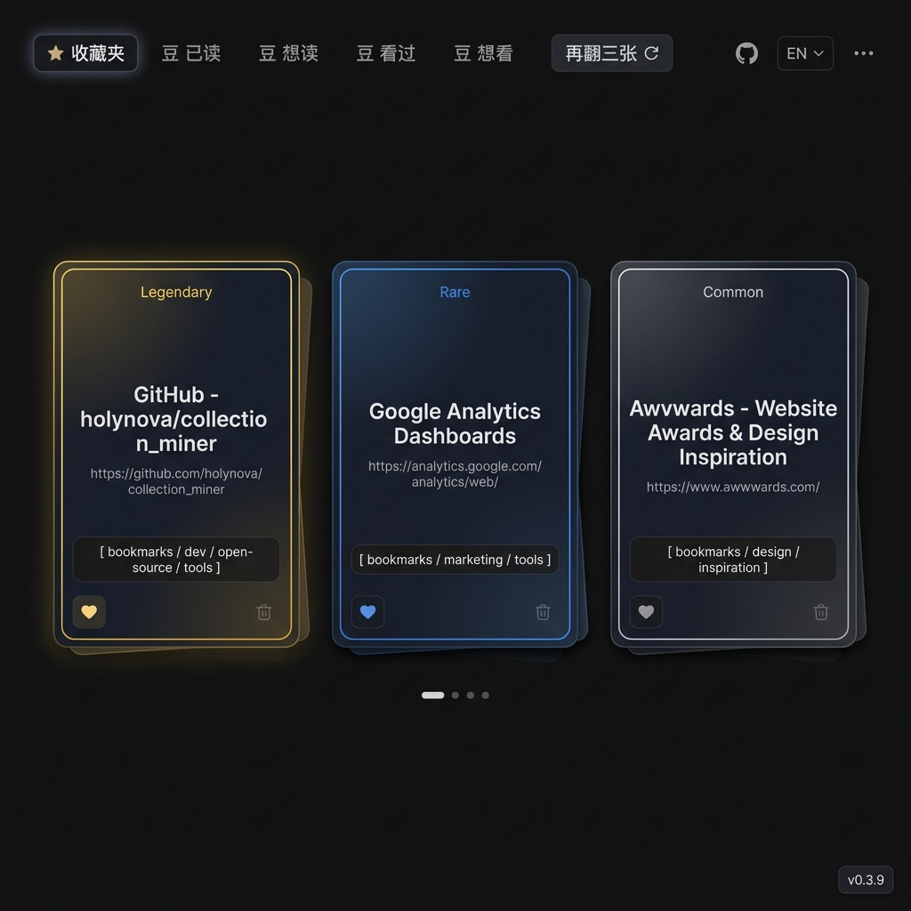

# Collection Miner / 收藏夹淘金

> 每次打开新标签页，都能重新发现一条被遗忘的书签。

---

## 中文说明

**Collection Miner** 是一个精致的 Chrome 插件，接管你的新标签页，从浏览器书签库中随机挑选 3 条，以卡片形式呈现。通过持续的点赞/点踩，系统会学习你的偏好，让真正喜欢的书签出现得更频繁。

### 功能特性

**动态权重系统**
- 点赞（♥）让这条书签在未来更容易被抽到；点踩则相反。
- 系统追踪每条书签的展示次数、点击次数、赞/踩次数，动态调整权重。

**视觉分级**
- **稀有度**：根据交互评分，卡片获得边框光晕等级——`传说 Legendary`（金）、`稀有 Rare`（紫/蓝）、`普通 Common`（白）、`诅咒 Cursed`（暗）。
- **年龄层**：根据书签收藏的时间长短，卡片呈现不同光泽——`金（5年+）`、`紫（3年+）`、`蓝（2年+）`、`绿（1年+）`、`白（1年内）`。

**卡片交互**
- 点击卡片正面 → 在新标签页打开书签链接（记录一次点击）。
- ♥ 按钮 → 点赞，提升权重。
- 🗑 按钮 → 删除书签（8 秒内可撤销）。

**高质感视觉设计**
- 每张卡片都有 3D 鼠标跟随倾斜效果与交互式光晕。
- 翻入/翻出均采用无缝 3D 翻转动画。
- 卡背为青绿色调品牌设计（Collection / Miner）。

**快捷刷新**
- 点击 `再翻三张` 按钮。
- 按 `Enter` 或 `空格键`。
- 点击页面任意空白区域。

**数据管理**
- 点击右上角 `⋯` 菜单 → **导出数据** / **导入备份**，将书签权重和历史记录保存为本地 JSON，防止数据丢失。

**其他**
- 中英文界面切换（右上角 `EN` 按钮）。
- 检测到多个本插件新标签页时，提供一键"关闭其他"按钮。

---

## English

**Collection Miner** is a focused Chrome extension that replaces your new tab page with a card-based view of your browser bookmarks. Each time you open a new tab, 3 bookmarks are randomly drawn from your library. Like and dislike them to teach the system your preferences over time.

### Features

**Smart Weighting**
- Liking (♥) a bookmark increases its chance of appearing again; disliking decreases it.
- The system tracks impressions, clicks, and ratings to continuously refine what you see.

**Visual Tiers**
- **Rarity**: Cards earn glowing border tiers based on your ratings — `Legendary` (gold), `Rare` (purple/blue), `Common` (white), `Cursed` (dark).
- **Age Tier**: Cards display a metallic luster based on how long ago you saved them — `Gold (5yr+)`, `Purple (3yr+)`, `Blue (2yr+)`, `Green (1yr+)`, `White (new)`.

**Card Interactions**
- Click a card → opens the bookmark link in a new tab (counts as a click).
- ♥ → like and boost the bookmark's weight.
- 🗑 → delete the bookmark (8-second undo window).

**Premium Design**
- Mouse-driven 3D tilt and interactive spotlight halo on every card.
- Seamless flip-in / flip-out animations on refresh.
- Teal-themed card backs with the Collection Miner branding.

**Refresh Shortcuts**
- Click the `Refresh` button.
- Press `Enter` or `Space`.
- Click any blank area on the page.

**Data Management**
- Click `⋯` in the top-right → **Export Data** / **Import Backup** to save all bookmark weights and history as a local JSON file.

**More**
- One-click Chinese / English language toggle (`EN` button, top-right).
- Detects duplicate Miner tabs and offers a "Close Others" button to keep your workspace tidy.

---

## 安装 / Install

**Chrome Web Store（推荐）**

> *(即将上架 / Coming soon)*

**手动安装 / Manual Install**

1. 下载或克隆本仓库 / Download or clone this repository
2. 打开 `chrome://extensions`
3. 开启右上角「开发者模式」/ Enable "Developer mode"
4. 点击「加载已解压的扩展程序」/ Click "Load unpacked"
5. 选择本项目文件夹 / Select this project folder

---

## 隐私 / Privacy

本插件完全本地运行，不收集、不传输任何数据。所有书签数据和权重仅存储在你的浏览器本地。

This extension runs entirely locally. No data is collected or transmitted. All bookmark data and weights are stored only in your browser's local storage.

→ [完整隐私政策 / Full Privacy Policy](https://holynova.github.io/collection_miner/)
